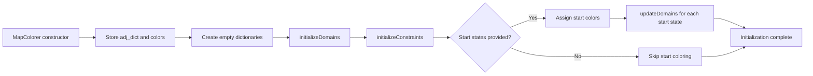
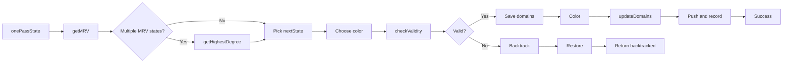

#Map Coloring CSP
This project uses a list of adjacent counties or states to color an interactive map according to user specifications. Developed with a blazor front end and a flask backend, the program displays a cshtml interactive SVG of a region, either the United States or the counties of Ohio, to color each state with a selection of colors specified by the user.

To Use
#Requirements:
-Python 3 or later
-Dotnet sdk 9.0 or later

#To Run:
-Run the flask backend:
  -Enter the python folder in wwwroot/python in the command prompt
  -Create a new virtual environment within the above folder and import all required modules (will display requirements when running the command below)
  -run the server using "python server.py" in the command prompt
-Start the blazor application:
  -Enter the folder in the command prompt or open the folder with Visual Studio
  -Run 'dotnet run' inside the folder to start the program, and open the address listed in a web browser (localhost:5168)
  -Alternatively, run with Visual Studio and open the address in a web browser

#Features
-Fully interactive javascript map that allows the user to pre-color states before starting the CSP
-Color picker to choose colors as desired
-Realtime updates to the map to display the process during each step of the CSP
-List of domains available per region and backtracking options per state
-Will continuously attempt to backtrack until a solution is found, even if one does not exist
-Map selection, either US States or Ohio counties

#Initialization flow

#Main CSP search flow

